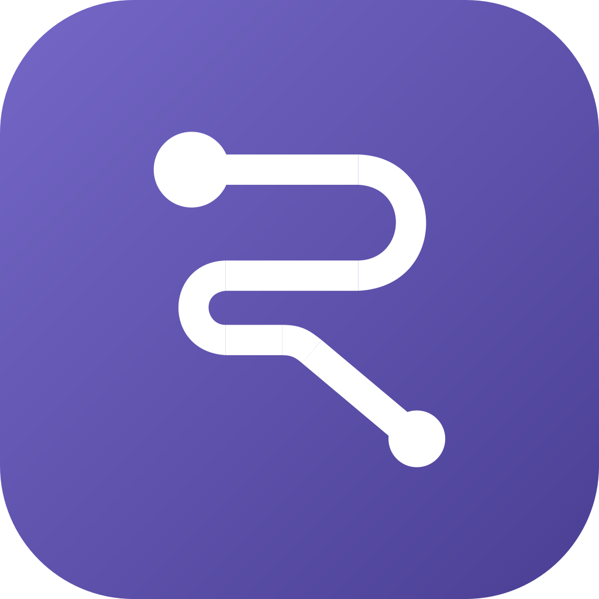
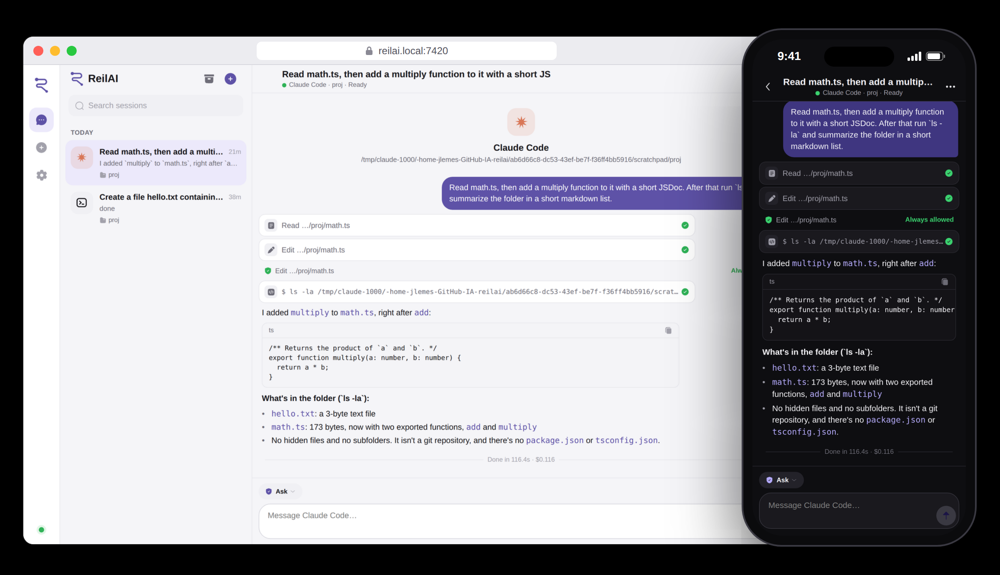

<p align="center">
  
</p>

<h1 align="center">ReilAI</h1>

<p align="center"><b>Claude Code and Codex, anywhere.</b><br/>
Start, follow and approve your coding agents from the terminal, the browser or your phone.<br/>
Every conversation is shared and live on all of them.</p>

<p align="center"></p>

## Why

Coding agents are great until you step away from the keyboard: a long task stops on a
permission prompt, or you want to check what it did from the couch. ReilAI is a small,
self-hosted remote control for **Claude Code** and **Codex**, inspired by
[Happy](https://github.com/slopus/happy), with a focus on light services and a polished UI:

- **One source of truth.** A local daemon owns every session. The CLI, the browser and the native
  app are just views, so a session started in one place streams live everywhere.
- **Two independent front doors.** A web service (browser, desktop and mobile PWA) and an
  end-to-end encrypted tunnel for the native app. Stopping one never affects the other.
- **Real agents, not wrappers.** Claude Code runs through the official Agent SDK, Codex through
  `codex app-server`: your login, settings, `CLAUDE.md`/`AGENTS.md`, MCP servers and tools.
- **English and Portuguese**, switchable from any client (the CLI included).

## Features

- Sessions list grouped by activity, search, archive, project folders and live status
  (working, needs approval, ready, error).
- Chat with token streaming, Markdown and code blocks, collapsible thinking and compact tool calls
  with full input/output on tap.
- Permission cards: **Allow**, **Always allow** (for the session) or **Deny**, from any device.
- Four portable permission modes for both agents: `Ask`, `Auto edits`, `Plan`, `Yolo`.
- Model picker right next to the mode, fed by each agent's live catalog (Claude Agent SDK
  `supportedModels()`, Codex `model/list`). Claude switches mid-session; Codex from the next turn.
- Happy-style start from the home screen: one text field; focusing it raises the computer, folder
  and agent rows, with mode and model in the field itself. The New tab keeps the full form
  (agent, model, folder browser where one tap opens and selects a folder, permissions).
- Open files and images from a session: project file browser, "Open file" on tool calls, tappable
  paths in replies, code with line numbers, rendered Markdown and image preview.
- Session menu on a long press (mobile and PWA) or the row buttons (desktop), with the same options
  as the chat menu; swipe a session left to reveal **Archive**, like Happy. Archiving stops the
  agent (you get a warning if it is still working).
- Light on memory: idle agents stop after 15 minutes (`REILAI_IDLE_STOP_MINUTES`) and stopped
  sessions are shown faded. **Resume** (or just sending a message) restarts the agent with its
  previous context and unarchives the session.
- Light, dark or system theme. Desktop layout with a sessions sidebar you can resize by dragging
  its edge (remembered per device, double click to reset) and a **New chat** button while a
  conversation is open; mobile layout with a native-feeling tab bar. Installable as a PWA.
- Native Android app built with [Lynx](https://lynxjs.org): native bottom navigation, the
  same screens as the web, pairing by QR code.

## How it works

```
                 ┌──────────── your computer ──────────────────────────────────────┐
  terminal ───── │  reilai CLI ─┐                                                  │
                 │              ├──► daemon (127.0.0.1:7410) ──► Claude Agent SDK  │
  browser/PWA ── │ web :7420 ───┤      SQLite, sessions,        └► codex app-server │
                 │              │      live event fan-out                          │
  native app ─┬─ │ tunnel :7430 ┘                                                  │
              │  └──────────────────────────────────────────────────────────────────┘
              └── relay (optional, public host, sees only ciphertext)
```

- **Daemon** (`apps/cli`): runs the agents, stores sessions in SQLite and pushes every change
  (new message, streamed token, tool result, permission request) to all connected clients.
- **Web service** (`apps/web`): serves the browser shell and proxies RPC/events, protected by an
  access token.
- **Tunnel** (`apps/tunnel`): the native app's door. X25519 handshake (ephemeral + static keys,
  forward secrecy and mutual authentication), HKDF-SHA256 and AES-256-GCM frames with replay
  protection. Reachable on your LAN/Tailscale directly, or from anywhere through the optional
  **blind relay** (`apps/relay`). See [docs/security.md](docs/security.md).
- **Frontend** (`apps/app`): one ReactLynx project, one bundle per screen, compiled for native
  (`.lynx.bundle`) and for the browser (`.web.bundle` inside `<lynx-view>`). Screens talk to a
  small `ReilHost` bridge that each host implements. See [docs/architecture.md](docs/architecture.md).

## Status

| Piece | State |
| --- | --- |
| Daemon, CLI, Claude Code and Codex runners | Working, tested with real sessions |
| Web service (desktop, mobile, PWA) | Working, tested in Chromium |
| Tunnel + relay (end-to-end encryption, pairing, revocation) | Working, covered by unit tests and an end-to-end smoke test |
| Android host | Builds; pairing over the tunnel verified on an emulator. Needs testing on a real ARM phone (x86_64 emulators with ARM translation crash the Lynx runtime) |
| iOS host | Not started (the `ReilHost` bridge and CryptoKit primitives are ready for it) |

## Requirements

- [Bun](https://bun.sh) 1.3+
- [Claude Code](https://docs.claude.com/en/docs/claude-code) and/or [Codex CLI](https://github.com/openai/codex), installed and logged in
- Android app: Android SDK + JDK 17 (to build it yourself)

## Quick start

```bash
git clone https://github.com/JonathanLemes/reilai.git
cd reilai
bun install
bun run build                       # Lynx bundles + web shell
ln -s "$PWD/apps/cli/bin/reilai" ~/.local/bin/reilai

reilai up                           # daemon + tunnel + web, prints the browser link
reilai claude "explain this repo"   # Claude Code's own UI, shared live with browser and phone
```

Open the printed `http://<your-ip>:7420/#token=…` link on any device (it is remembered).
On a phone, "Add to Home Screen" installs it as an app.

### Native Android app

```bash
cd apps/app && bun run android      # builds bundles + debug APK
adb install android/app/build/outputs/apk/debug/app-debug.apk
reilai pair                         # scan the QR code with the phone camera
```

The QR code opens `reilai://pair?…` in the app, which pins the computer's key and pairs over the
encrypted tunnel. To reach the computer outside your network, run `reilai relay` on a public host
(behind TLS) and start the tunnel with `reilai tunnel start --relay wss://your-relay`.

## CLI

| Command | What it does |
| --- | --- |
| `reilai claude [prompt]` / `reilai codex [prompt]` | New session in the current folder, in the agent's own terminal UI (slash commands, autocomplete, shortcuts). Everything is shared live with the browser and the app, and either side can continue it. `Ctrl+]` leaves the UI without stopping the agent |
| `reilai ls [--archived]` | List sessions |
| `reilai attach <id>` | Open any session (also ones started in the browser) in the agent's UI. `--plain` gives the line view (approve with `y`/`a`/`n`, `/stop`, `/mode plan`, `/model sonnet`, `/exit`) |
| `reilai send <id> <text>` | Send a message without attaching |
| `reilai new <agent> [--cwd dir] [--mode ask\|edits\|plan\|yolo] [--model id] [prompt]` | Create a session |
| `reilai models <agent>` | Models you can pick (`--model`, `/model <id>` while attached) |
| `reilai end <id>` | Stop the agent (frees its memory) |
| `reilai resume <id>` | Start it again with its context, unarchive and open it in the agent's UI |
| `reilai rm <id>` | Delete a session |
| `reilai up` / `reilai down` | Start / stop daemon, tunnel and web |
| `reilai start` / `stop` / `status` | The daemon only |
| `reilai web [start\|stop] [--port 7420]` | Browser / PWA service |
| `reilai tunnel [start\|stop] [--port 7430] [--relay URL]` | Encrypted tunnel |
| `reilai relay [start\|stop] [--port 7440]` | Blind relay |
| `reilai pair` | Pair a phone (QR code) |
| `reilai devices [revoke <id>]` | Paired devices |
| `reilai lang [en\|pt\|system]` | Language for every client |

Session ids accept any unique prefix. State lives in `~/.reilai` (`REILAI_HOME` to override).

## Project layout

```
apps/
  cli/        reilai CLI + daemon (agents, SQLite, RPC)
  web/        web service + browser/PWA shell (React + <lynx-view>)
  tunnel/     encrypted tunnel gateway (+ device client reference, smoke test)
  relay/      blind relay
  app/        Lynx screens (sessions, chat, new, settings, pair) + android/ host
packages/
  protocol/   RPC and event contract, daemon client
  crypto/     tunnel handshake and secure channel
  i18n/       English and Portuguese dictionaries
  brand/      logo, palette and Solar icons
docs/         architecture and security
```

## Development

```bash
bun run check-types                 # every package (Turborepo)
bun run test                        # unit tests (crypto, markdown…)
bun apps/tunnel/scripts/smoke.ts    # end-to-end tunnel check against a running daemon + tunnel
cd apps/app && bun run dev          # Lynx dev server
cd apps/web && bun run dev          # web shell dev server (proxies to :7420)
```

## Credits

- [Happy](https://github.com/slopus/happy), the project that inspired ReilAI's protocol and
  encryption model.
- [Lynx](https://lynxjs.org) for the cross-platform UI.
- Icons: [Solar](https://www.figma.com/community/file/1166831539721848736) by 480 Design (CC BY 4.0).

## License

MIT License. See [LICENSE](LICENSE).
